# 第3章｜業務改革実践：AIエージェント活用の進め方

---

## 章の概要

本章は、AIエージェントを業務に導入するための**実践的な方法論**を解説する。単にAIツールを導入するのではなく、「業務プロセスの改革」として捉え、段階的・体系的に進めるためのフレームワーク・手法・役割分担を提供する。

---

## 3.1 業務分析の進め方

### 3.1.1 AIエージェント化に向けた業務分析・業務整理の流れ

AIエージェント導入を成功させるには、**現行業務の可視化と構造化**が前提となる。以下の流れで業務分析を行う。

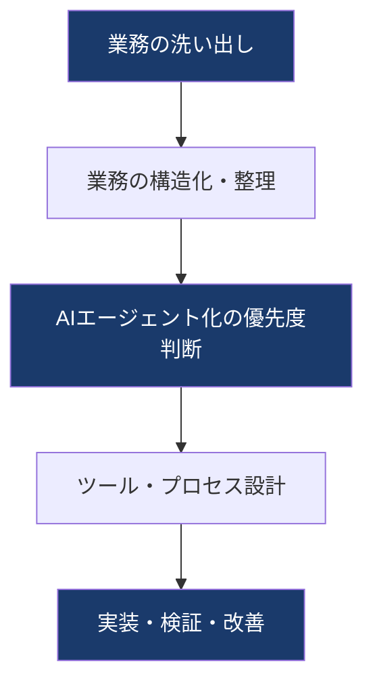

#### ① 業務の洗い出しと棚卸し

まず「何の業務が存在するか」を網羅的に把握する。

- **業務の種類**：定型業務・判断業務・コミュニケーション業務・情報収集業務など
- **作業頻度**：毎日/毎週/毎月/スポット
- **処理量**：件数、データ量、時間
- **担当者・関与部署**

> ポイント：業務の洗い出しでは、「実際に誰が何をやっているか」を現場ヒアリングで確認することが重要。マニュアルや組織図だけでは見えない業務が多数存在する。

#### ② 業務の構造化（階層的タスク分析）

洗い出した業務を階層的に分解する手法として **HTA（Hierarchical Task Analysis）** を活用する。

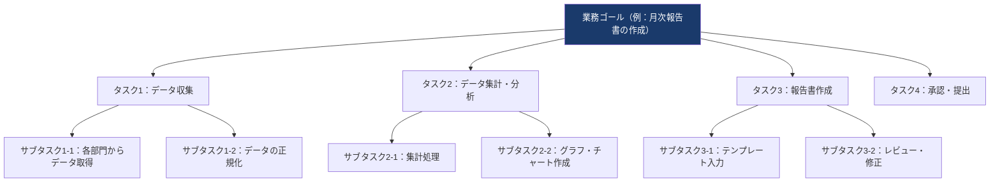

**HTAのポイント：**
- 業務を「ゴール → タスク → サブタスク」と階層的に分解
- 各レベルで「AIが実行可能か」「人間が必要か」を判断できるようになる
- AIエージェントの設計粒度を決定する基準となる

---

### 3.1.2 ツールの選定と業務プロセスの組み立て

#### （1）業務分析ツール：HTAでの業務分解・業務整理の手順

業務を正確に分解・整理するための手順：

1. **業務ゴールの定義**：何のためにその業務をするのかを明確化
2. **タスクの列挙**：ゴール達成に必要なタスクをすべて書き出す
3. **サブタスクへの分解**：各タスクをさらに細分化（実行可能な最小単位まで）
4. **実行条件・依存関係の整理**：どのタスクが完了してから次が始まるか
5. **AI実行可能性の評価**：各サブタスクについてAI対応可能か評価

#### （2）プロセス分析ツール：SIPOCの活用

**SIPOC**は業務プロセスを5つの要素で整理するフレームワーク。

| 要素 | 意味 | 具体例（受注処理業務の場合） |
|------|------|-------------------------------|
| **S** (Supplier) | プロセスへのインプットを提供する人・部署 | 営業担当、顧客 |
| **I** (Input) | プロセスへの入力データ・情報 | 注文書、顧客情報、在庫データ |
| **P** (Process) | 実行されるプロセス（複数のフロー） | 受注確認→在庫確認→出荷指示→請求処理 |
| **O** (Output) | プロセスの成果物・出力 | 出荷伝票、請求書、納品確認メール |
| **C** (Customer) | アウトプットを受け取る人・部署 | 顧客、物流部門、経理部門 |

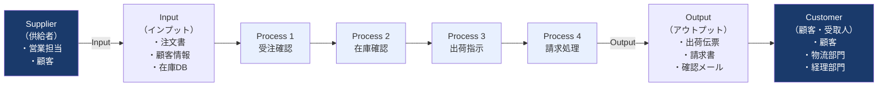

**SIPOCの活用場面：**
- AIエージェント化する業務の**スコープ（範囲）**を定義するとき
- インプット・アウトプットを明確にして**AIへの指示（プロンプト）**を設計するとき
- 関係部署との合意形成・業務整理の議論の場

> **補足**：SIPOCの各要素は、AIエージェントの設計においてもそのまま対応する。SはデータソースやAPI、IはAIへの入力データ形式、Pはエージェントの処理フロー、Oはエージェントの出力形式、Cはエージェントの結果を受け取るシステム・担当者に対応する。

---

### 3.1.3 AIエージェント化を推進するための優先度基準

AIエージェント導入における**優先度判断の基準**を設ける。

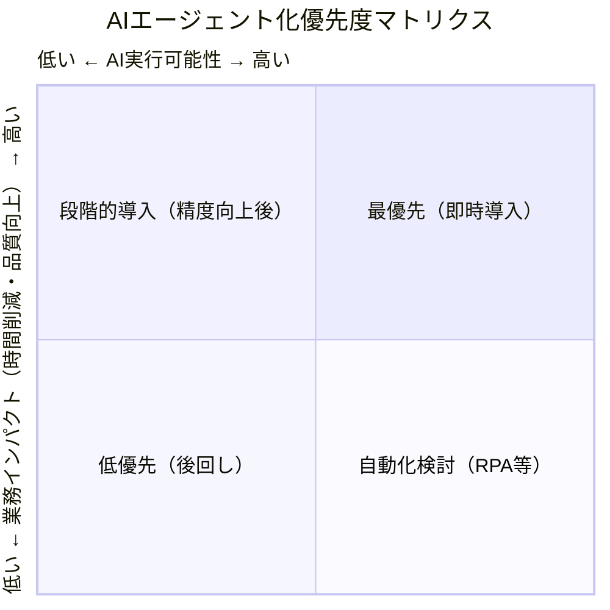

#### 優先度評価の観点

| 評価軸 | 高スコア（AIに向く） | 低スコア（人間向き） |
|--------|----------------------|----------------------|
| **定型性** | ルールが明確・繰り返し | 毎回判断が異なる |
| **データ量** | 大量処理が必要 | 少量・個別対応 |
| **判断の複雑さ** | パターン認識可能 | 高度な文脈・倫理判断 |
| **エラー許容度** | ある程度の誤りを許容 | ゼロエラー要求 |
| **業務頻度** | 高頻度・大量 | 低頻度・少量 |

#### AIエージェント化の適合性スコアリング（簡易版）

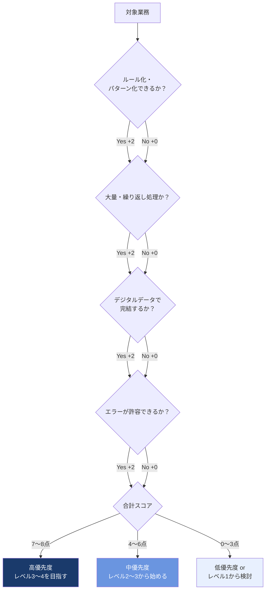

---

## 3.2 ツール・プロセスの組み立て方

### 3.2.1 タスクのAIエージェント化における「自動化レベル」を理解する

AIエージェント化を進めるにあたり、すべての業務が同じレベルで自動化できるわけではない。業務ごとに「自動化レベル」を設定し、段階的にアップグレードすることが重要である。

#### 自動化レベルの4段階

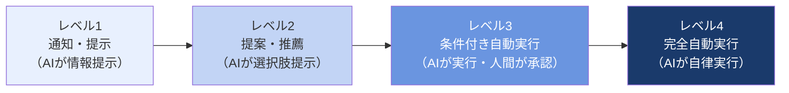

| レベル | 名称 | AIと人間の役割 | 具体的なユースケース |
|--------|------|---------------|-------------------|
| **レベル1** | 通知・提示 | AIが情報を提示し、判断・実行はすべて人間が行う。AIエージェントが取り扱えるデータ量・範囲は人間より広い | FAQに応じた情報提示、社内ナレッジのデータ検索、初期診断データ・カスタマーデータの収集・整理 |
| **レベル2** | 提案・推薦 | AIが選択肢や推薦を提示し、意思決定・確認は人間が行う。AIエージェントは一定の範囲の意思決定をカバーしている | SNS投稿内容の下書き提案、翻訳メモの作成、メール文面の作成、特定の入力に対してのテンプレート提案 |
| **レベル3** | 条件付き自動実行 | AIが一定条件下で自動実行し、例外・判断ケースは人間が対応。AIエージェントは複数ツールを連携させながら自律的に動く | 議事録・サマリーの自動作成と担当者への配布、国内外の競合調査ツールを横断した自動レポート生成、指定条件に合致した際の承認メール自動送信 |
| **レベル4** | 完全自動実行 | AIが完全に自律して実行し、人間への確認なしに処理が完結。AIエージェントは高度なタスクプランニングを実行できる | 大規模データの収集・分析・意思決定・自動実行（例：M&A候補の探索・比較・提案書作成）、チャットボットによる顧客対応の自動化 |

> **重要原則**：自動化レベルは「業務の性質」と「リスクの大きさ」によって決める。エラーが許容されない業務や倫理的判断が必要な業務はレベル1〜2に留める。反復的・定型的・大量処理業務はレベル3〜4が適している。

#### 自動化レベル決定の判断フロー

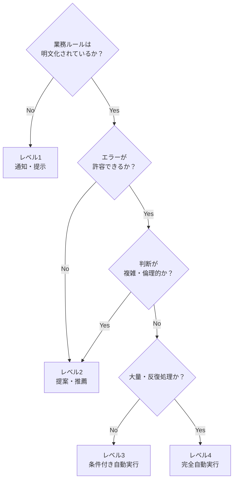

---

### 3.2.2 ロールプレイヤーの整理：RACI分析

AIエージェント化においては、**誰が何をするのか**を明確にするためにRACI分析を活用する。

| 記号 | 役割 | 説明 |
|------|------|------|
| **R** | Responsible（実行責任者） | 実際にタスクを実行する主体。AIエージェントが担う場合もある |
| **A** | Accountable（説明責任者） | 最終的な成果に対して責任を持つ人。人間が担う |
| **C** | Consulted（相談先） | タスク実行前に意見・情報を求める対象（双方向コミュニケーション） |
| **I** | Informed（報告先） | タスク完了後に通知を受ける対象（一方向コミュニケーション） |

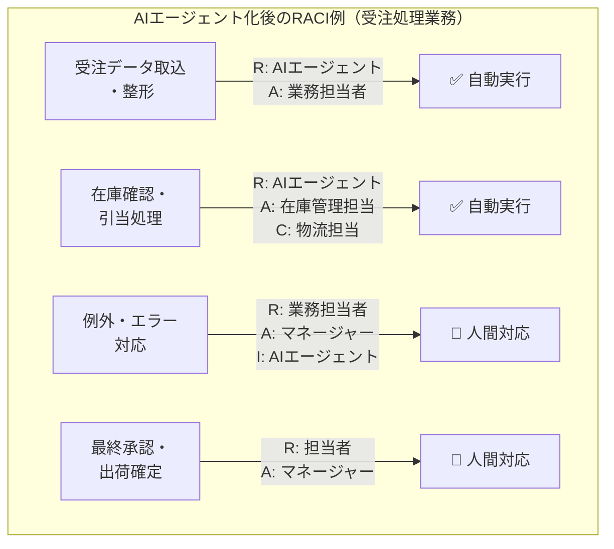

> **AI化のポイント**：RACIの「R（実行）」をAIエージェントに移譲しても、「A（説明責任）」は必ず人間が保持する。これがAIガバナンスの基本原則。

---

### 3.2.3 タスクのAIエージェント化に必要なプロセス設計

AIエージェントを実際に動かすには、業務プロセスをエージェント実行可能な形に設計し直す必要がある。

#### ① 実行可能なタスクへの分解

- 曖昧な指示（「報告書を作成して」）→ 実行可能な指示（「A・B・Cのデータを取得し、D形式に変換し、E宛に送信する」）
- 各ステップに**入力・処理・出力**を明確に定義する

#### ② ツールの選定と連携設計

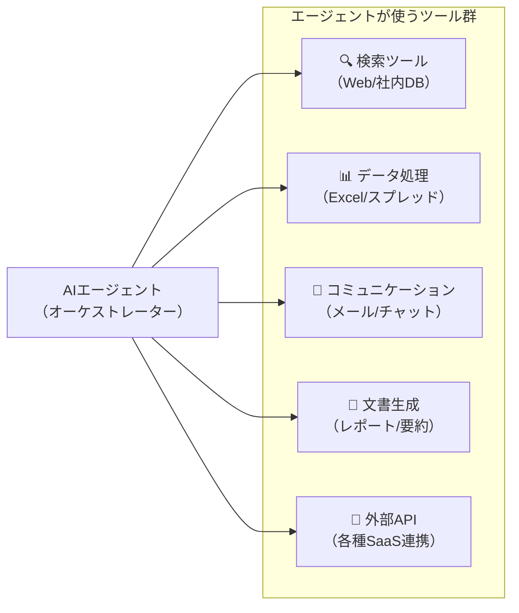

#### ③ 例外処理・エスカレーション設計

AIが自動実行できない例外ケースを事前に定義し、人間へのエスカレーションフローを設計する。

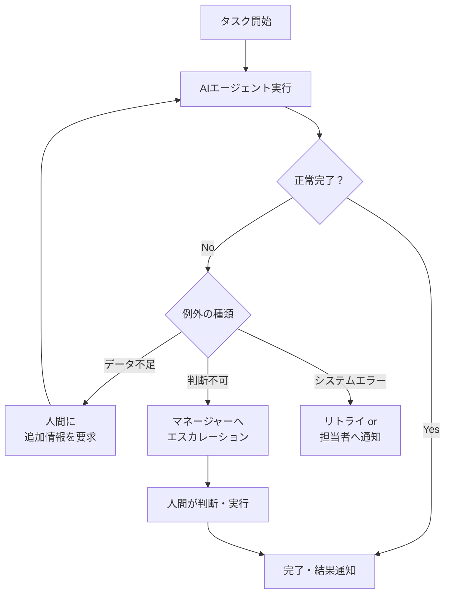

---

### 3.2.4 業務改革をうまく進めるためのポイント

#### 推進体制の構築

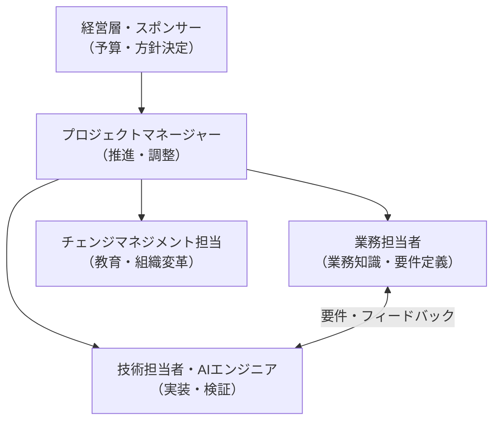

#### 段階的な推進ステップ

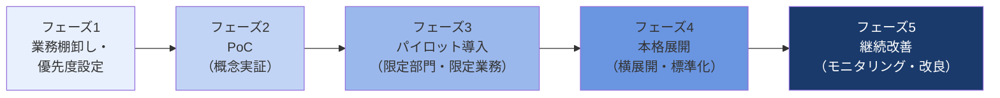

#### 変化への抵抗を乗り越えるポイント

1. **小さな成功体験を積む**：最初から大規模展開せず、効果が見えやすい業務から着手
2. **担当者を置き去りにしない**：「AIに仕事を奪われる」不安を払拭するコミュニケーション
3. **業務担当者を設計に巻き込む**：現場の知見をAI設計に活かし、当事者意識を醸成
4. **成果の見える化**：時間削減・品質向上・コスト削減などを定量的に示す

---

## 3.3 業務改革の型（パターン）を知ろう

### 業務AI化の代表的なパターン

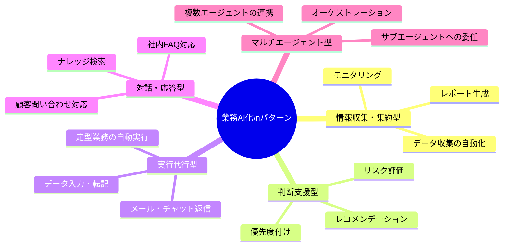

#### （a）情報収集・集約型
- **概要**：複数のデータソースから情報を収集・整理・要約する
- **例**：競合情報収集、日次レポート自動生成、市場調査
- **特徴**：人間が「読む・整理する」時間を大幅に削減

#### （b）判断支援型
- **概要**：人間の意思決定をサポートするための情報・評価を提供する
- **例**：営業案件のリスクスコアリング、採用候補者の一次評価
- **特徴**：最終判断は人間が行うが、判断の質と速度を向上させる

#### （c）実行代行型
- **概要**：定型的な実行業務をAIエージェントが代わりに行う
- **例**：受注処理の自動化、経費申請の自動仕訳、メール定型返信
- **特徴**：人間の稼働時間を直接削減できる最も分かりやすいROI

#### （d）対話・応答型
- **概要**：社内外からの問い合わせ・質問に自動で回答する
- **例**：社内FAQ Bot、カスタマーサポートBot、ナレッジ検索
- **特徴**：24時間対応、品質の均質化、人件費の削減

#### （e）マルチエージェント型（オーケストレーション型）
- **概要**：複数のAIエージェントが役割分担して協調動作する
- **例**：調査→分析→レポート作成→送付を各エージェントが分担
- **特徴**：複雑な業務プロセス全体をAI化できる最先端の形態

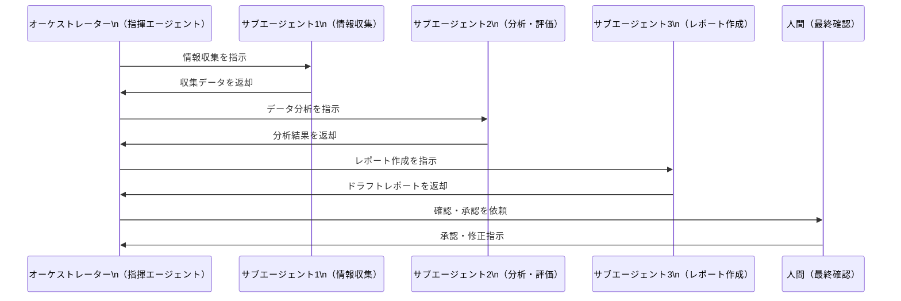

---

## 3.3.2 ロードマップを作ろう

### ロードマップ全体像

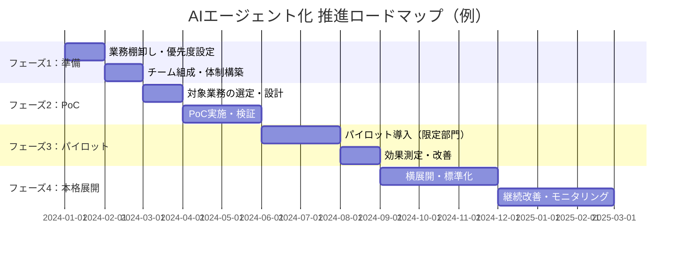

### ロードマップの4ステップ

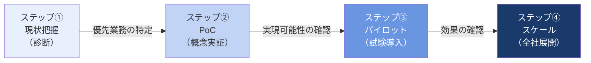

**ステップ①：現状把握（診断）**
- 業務の棚卸しと可視化（HTAやSIPOCを活用）
- AIエージェント化の優先度評価
- 現状のボトルネック・課題の特定
- 推進体制・予算・スケジュールの検討

**ステップ②：PoC（概念実証）**
- 優先度の高い業務を1〜2件選び、小規模に検証
- 検証のポイント：AIエージェントが技術的に実行可能か、期待する精度・速度が出るか、担当者が使いこなせるか

**ステップ③：パイロット（試験導入）**
- PoCで成果が確認できた業務を、限定された部署・チームで試験導入
- 現場からのフィードバックを収集し、プロセス・プロンプト・ツール連携を改善
- **成果指標（KPI）の設定**：処理時間削減率、エラー率、担当者の満足度など

**ステップ④：スケール（全社展開）**
- パイロットで確立した型を他部署・他業務に横展開
- 標準化されたプロセス・ツールセットを整備
- 継続的なモニタリングと改善サイクルの確立

### ロードマップ推進の4つのポイント

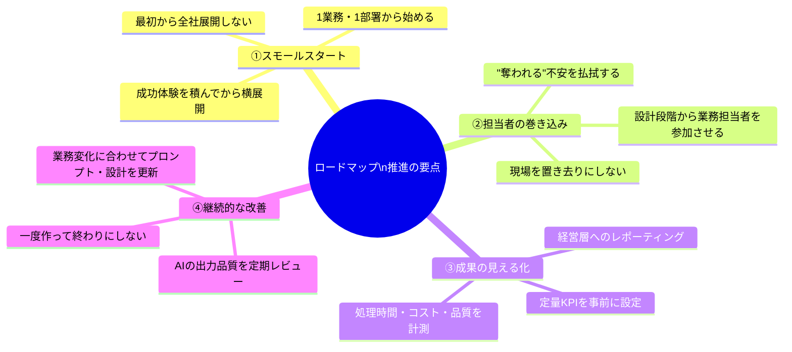

### ロードマップ推進における典型的な失敗パターン

| 失敗パターン | 原因 | 対策 |
|-------------|------|------|
| **PoC止まり** | 成果が見えにくい業務を選んだ / 組織変革が追いつかない | 効果が可視化しやすい業務を最初に選ぶ |
| **現場の抵抗** | 担当者が蚊帳の外で設計が進んだ | 設計フェーズから現場を巻き込む |
| **品質劣化** | AIの出力を検証せずに本番運用 | レビュー体制とフィードバックループを設ける |
| **スケールできない** | PoCが属人化・個別最適化 | 標準化・ドキュメント化を意識して設計する |

### 「自動化レベル×業務マトリクス」でのロードマップ設計

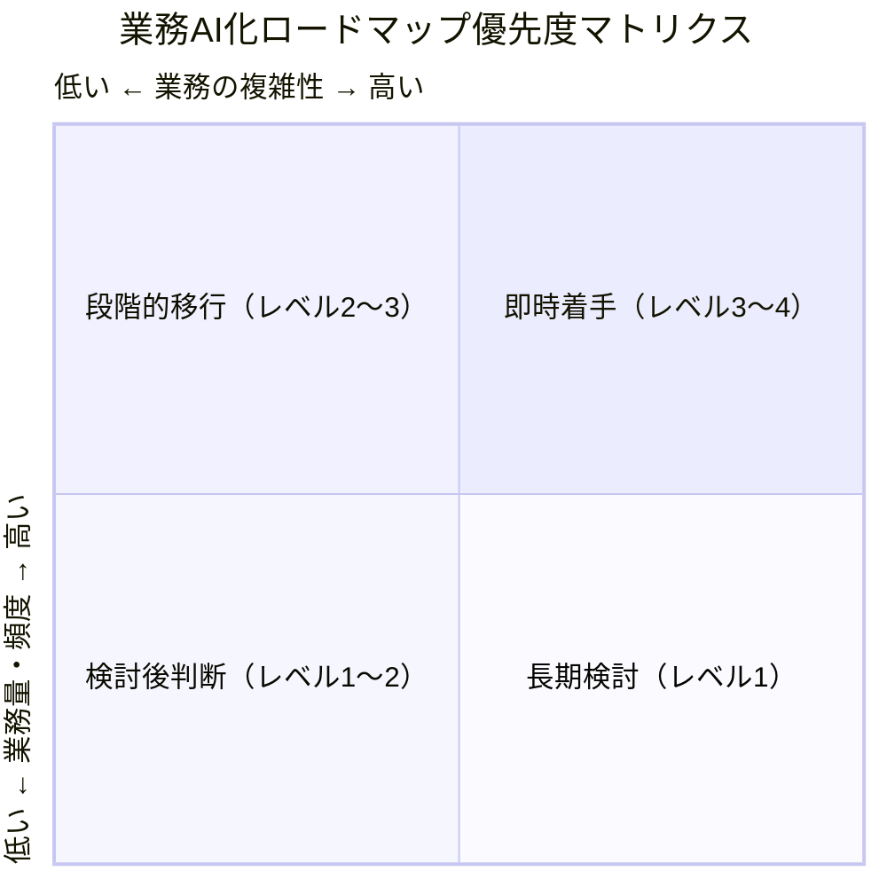

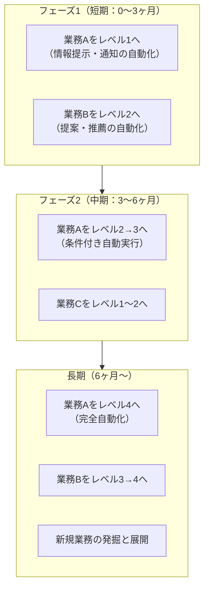

---

## 3.4 プロセスのOODAとプロンプト設計

### OODA（観察・状況判断・決断・行動）

AIエージェントの実行ループを理解するフレームとして**OODA（Observe-Orient-Decide-Act）**が活用できる。

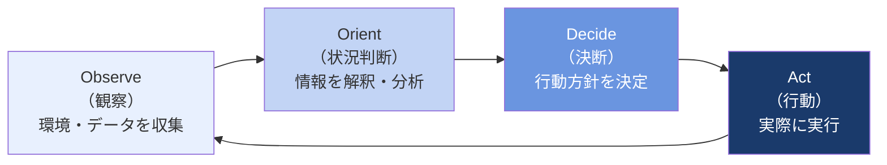

| OODAステップ | AIエージェントでの対応 |
|-------------|----------------------|
| **Observe（観察）** | ツールを使って情報・データを収集する（Web検索、DBクエリ、API呼び出し） |
| **Orient（状況判断）** | 収集した情報をLLMが解釈・分析し、状況を理解する |
| **Decide（決断）** | 次にとるべき行動・使うべきツールをLLMが判断・計画する |
| **Act（行動）** | 選択したツールを実行し、結果を環境にフィードバックする |

---

### 3.4.1 プロンプト設計の勘所

AIエージェントを設計する際、プロンプト（指示文）の品質が成果を左右する。

```mermaid
mindmap
  root((良いプロンプト\nの構成要素))
    役割の定義
      誰として動くか
      専門性・トーン
    目標の明確化
      何を達成するか
      成果物の形式
    制約条件
      やってはいけないこと
      使えるツール・使えないツール
    コンテキスト
      背景情報
      参照すべきデータ・ドキュメント
    出力形式
      フォーマット指定
      長さ・構造
```

#### ① 役割（ロール）のプロンプト設計
- AIエージェントに「何者として振る舞うか」を明確に定義する
- 例：「あなたは経験豊富な業務改革コンサルタントです」
- **効果**：一貫したトーン・専門性・判断基準をエージェントに持たせることができる

#### ② 目標（ゴール）のプロンプト設計
- AIエージェントが何を達成すべきかを具体的に記述する
- 曖昧な目標「レポートを作って」ではなく「競合A・B・Cの直近3ヶ月の製品アップデートを調査し、表形式で比較レポートを作成せよ」のように具体化する

#### ③ 制約（コンテキスト）のプロンプト設計
- やってはいけないこと、使えないリソース、守るべきルールを明記する
- 例：「個人情報を含む情報はレポートに記載しないこと」「外部への送信前に必ず担当者の確認を取ること」

#### ④ 出力形式（フォーマット）のプロンプト設計
- 成果物の構造・形式・長さを指定する
- 例：「マークダウン形式で出力」「箇条書きで5項目以内にまとめる」「表形式で比較する」

### プロンプト設計の改善サイクル

```mermaid
flowchart LR
    Design["プロンプト設計\n（初稿）"] --> Test["テスト実行"]
    Test --> Eval["出力評価\n・期待通りか？\n・エラーはあるか？"]
    Eval -->|改善点あり| Refine["プロンプト改善\n・曖昧さを排除\n・制約を追加\n・例示を追加"]
    Refine --> Test
    Eval -->|OK| Deploy["本番運用"]
    Deploy --> Monitor["継続モニタリング\n・出力品質の監視\n・定期的な見直し"]
    Monitor -->|品質劣化| Refine
```

---

## 補足：業務ヒアリングのための主要な問い

業務のAIエージェント化を支援するサブエージェントが、業務担当者に投げかけるべき問いの一覧。

| ヒアリング軸 | 問いの例 |
|-------------|---------|
| **業務の目的** | 「この業務は最終的に何のために行っていますか？」 |
| **現状の課題** | 「この業務で最も時間がかかっている・手間がかかっているのはどの部分ですか？」 |
| **インプット** | 「この業務を始めるにあたって必要な情報・データは何ですか？」 |
| **アウトプット** | 「この業務の成果物（出力）は何ですか？誰に渡しますか？」 |
| **判断のルール** | 「この業務の中で、どのような基準で判断をしていますか？ルールは明文化されていますか？」 |
| **例外ケース** | 「通常と異なる処理が発生するのはどんな場合ですか？」 |
| **頻度・量** | 「この業務は1日・1週間に何件くらい発生しますか？」 |

---

## キーワード整理

| 用語 | 定義 |
|------|------|
| **HTA（Hierarchical Task Analysis）** | 業務をゴール→タスク→サブタスクと階層的に分解する手法 |
| **SIPOC** | Supplier/Input/Process/Output/Customerの5要素で業務プロセスを整理するフレームワーク |
| **RACI分析** | Responsible/Accountable/Consulted/Informedで役割分担を整理する手法 |
| **自動化レベル（Level 1〜4）** | AIエージェントが業務をどの程度自律的に実行するかを示す4段階の分類 |
| **AIエージェント** | 目標に向かって自律的に計画・実行・判断できるAIシステム |
| **オーケストレーター** | 複数のサブエージェントを指揮・調整する親エージェント |
| **サブエージェント** | 特定タスクに特化した子エージェント。オーケストレーターの指示で動く |
| **PoC（概念実証）** | 本格導入前に小規模で実現可能性を検証するプロセス |
| **ロードマップ** | AIエージェント化を段階的に推進するための時系列計画 |
| **OODA（観察・状況判断・決断・行動）** | AIエージェントの実行ループを表すフレームワーク |
| **エスカレーション** | AIが処理できない例外ケースを人間に引き継ぐ仕組み |
| **プロンプト設計** | AIエージェントへの指示文（役割・目標・制約・出力形式）を設計すること |
| **スモールスタート** | 一部の業務・部署から小さく始め、成果確認後に横展開する進め方 |
| **チェンジマネジメント** | 組織変革を円滑に進めるための人・プロセス・文化の管理手法 |
| **KPI（重要業績指標）** | AI化の効果を測るための定量指標（処理時間削減率、エラー率など） |

---

*本ドキュメントはRAG（Retrieval-Augmented Generation）用ナレッジとして作成。対象書籍：『AIエージェントの教科書』（ワン・パブリッシング、ISBN: 978-4-651-20527-4）第3章（pp.106〜144）より。*
