# 第4章｜組織立案：AIエージェント導入の全社的アプローチ

---

## 章の概要

本章では、AIエージェントを**個人・部署レベル**の活用から**全社的な組織導入**へとスケールさせるための戦略・体制・ガバナンスを解説する。技術的な実装だけでなく、人・組織・文化をどう変えていくかを中心に論じる。

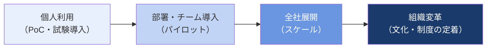

---

## 一｜エージェント導入と組織の相互作用

### AIエージェント導入が組織にもたらす変化

AIエージェントの全社導入は、単なるツール導入ではなく、**組織の働き方・役割・文化そのもの**を変える取り組みである。

導入に際して組織に生じる変化の3層：

- **業務層の変化**：従来「人が実行していたタスク」がAIに移行し、人間の仕事の重心が変わる
- **役割層の変化**：「業務を実行する人」から「AIをマネジメントする人」へと役割が再定義される
- **文化層の変化**：意思決定スピード・実験文化・失敗への許容度が問われる

> AIエージェント導入の最大の障壁は「技術」ではなく「組織・文化」である。技術的な実装よりも、組織変革のマネジメントに多くのエネルギーを注ぐべきである。

---

## 4.1 導入を進める組織体制の整備

### 4.1.1 導入を推進するチームの役割分担

AIエージェント導入を全社的に推進するには、複数の機能を持つチームの協働が必要である。

#### 推進チームの組成アプローチ

AIエージェント導入チームは、以下の3つの観点で整理される。

- **技術観点の整備**：テクノロジー、仕様書、機能をカバーするメンバーが必要
- **業務観点の整備**：業務プロセス整理、意思決定の整理、導入後の業務設計ができるメンバーが必要
- **変革観点の整備**：推進力、変化への抵抗管理、社内コミュニケーションができるメンバーが必要
- **統括観点の整備**：全体調整力、ステークホルダーマネジメント、ゴール管理ができるメンバーが必要

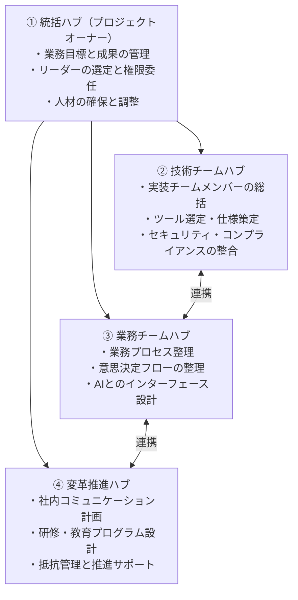

#### 各ハブの具体的な役割

**① 統括ハブ（プロジェクトオーナー）**
- 業務目標と成果の全体管理
- リーダーの選定と権限委任
- 予算・人材・スケジュールの確保と調整

**② 技術チームハブ**
- 実装チームメンバーの総括
- ツール選定・連携仕様の策定
- セキュリティ・コンプライアンス・ガバナンスとの整合

**③ 業務チームハブ**
- 業務プロセスの整理とドキュメント化
- AIエージェントと人間のインターフェース設計
- 業務担当者との要件定義

**④ 変革推進ハブ**
- 社内向けコミュニケーション計画の立案と実行
- 研修・教育プログラムの設計
- 変化への抵抗管理と現場サポート

---

### 4.1.2 業務のAXと導入後の変化を踏まえた推進を考える

AIエージェント化を進める際、業務変革（AX：AI Transformation）は段階的に起こる。

#### AXの3フェーズ

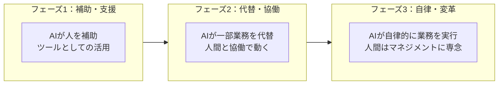

#### 導入後の「業務の型」の変化

AXが進むと、人間の業務の重心が以下のように変化する：

| 変化前（AX前） | 変化後（AX後） |
|--------------|--------------|
| データ収集・整理 | データの解釈・活用戦略 |
| 定型文書作成 | 要件定義・品質判断 |
| 情報検索・調査 | 課題設定・洞察の抽出 |
| 定型処理の実行 | 例外対応・判断・承認 |
| 報告・共有作業 | 意思決定・次のアクション設計 |

---

### 4.1.3 業務のフォーカスエリアの設定

AIエージェント化に取り組む組織は、**フォーカスエリア**（集中領域）を明確に定義することが重要である。

全方位的に進めようとすると、リソースが分散して成果が出にくい。優先領域を絞り、そこで確実な成果を出してから横展開する。

#### フォーカスエリアの設定観点

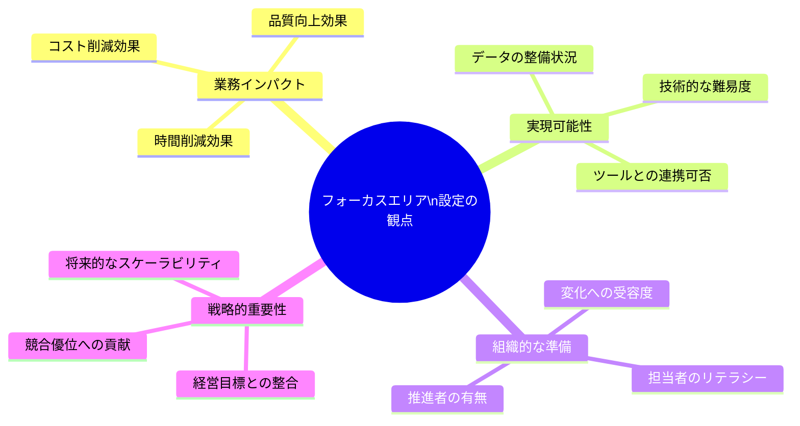

#### フォーカスエリアの具体的な設定プロセス

3つのカテゴリで業務を整理する：

**[探索ゾーン]** 技術検証・小実験が必要な領域
- まだ実績がない、AIで対応できるか未検証
- PoC・小実験から始める

**[展開ゾーン]** すでに実績があり、横展開できる領域
- PoCや他社事例で効果が確認されている
- 標準化してスケールさせる段階

**[成熟ゾーン]** 既に安定稼働している領域
- モニタリングと継続改善が主な取り組み
- 人材を次のフォーカスエリアへ移行させる

---

### 4.1.4 全社的な推進に向けた組織連携・体制整備

AIエージェントを全社的に推進するには、各部門が孤立して取り組むのではなく、**組織横断での連携体制**を整える必要がある。

#### エージェント導入における組織連携の要点

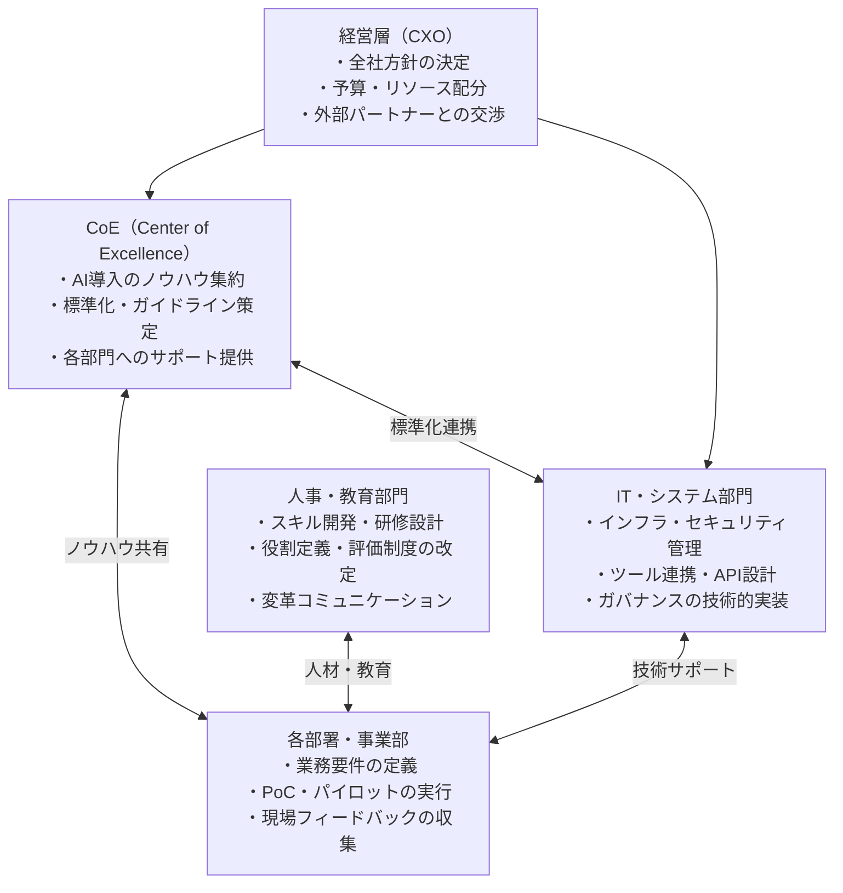

#### CoE（Center of Excellence）の役割

CoEはAIエージェント導入の**知識・ノウハウ・標準を集積・配布する中枢機能**である。

- **知識集約**：各部門のPoC・導入事例を収集し、ベストプラクティスを整理する
- **標準化**：プロンプトテンプレート、ツール選定基準、セキュリティガイドラインを策定する
- **支援・伴走**：各部門の導入を技術・業務・変革の観点からサポートする
- **能力開発機能**：ロールアウトに向けたトレーニングプログラムを提供する

#### エージェント導入における組織的な障壁と対策

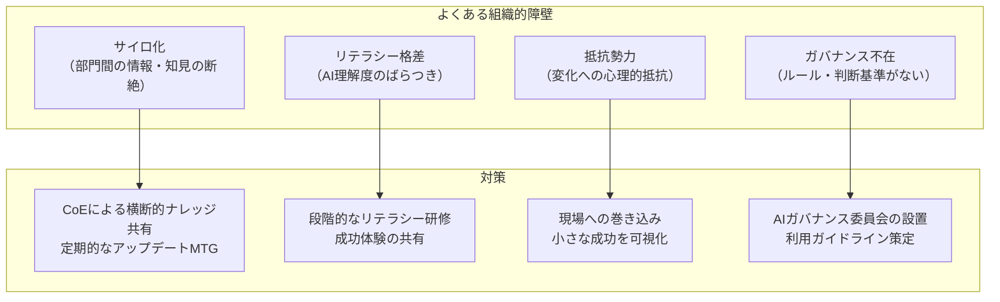

---

## 二｜変革推進画の打ち手

### 4.2.1 エージェント導入に伴う組織変革の推進

AIエージェント導入は、技術変革と組織変革が同時に進む複合的なプロジェクトである。

#### 組織変革を成功させる3要素

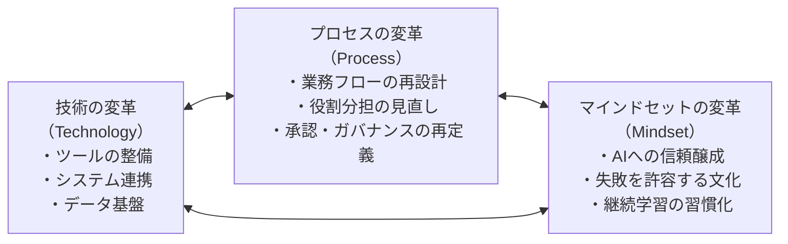

> **重要**：技術・プロセス・マインドセットの3つが揃って初めて変革は定着する。技術だけ整えても、プロセスや文化が追いつかなければ「使われないツール」になる。

#### チェンジマネジメントの4フェーズ

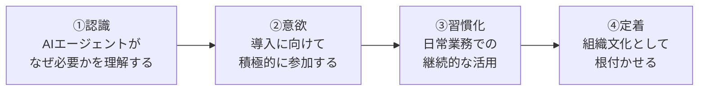

---

### 4.2.2 エージェント活用の推進に必要なスキル開発

組織全体にAIエージェントを定着させるには、各レイヤーのメンバーに適したスキル開発が必要である。

#### 役割別の必要スキルマップ

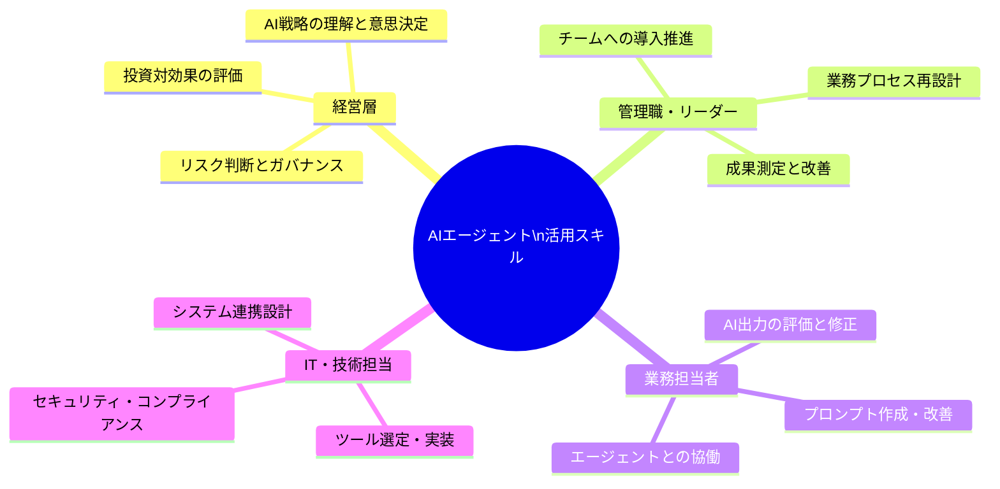

#### スキル開発の段階的プログラム

| ステップ | 対象 | 内容 | 形式 |
|---------|------|------|------|
| **基礎理解** | 全社員 | AIとは何か、AIエージェントの基礎概念 | eラーニング、動画 |
| **実践活用** | 業務担当者 | プロンプト作成、ツール操作、出力評価 | ワークショップ、OJT |
| **設計・推進** | リーダー・推進担当 | 業務設計、チェンジマネジメント、KPI設定 | 研修、伴走支援 |
| **高度活用** | IT・AI担当 | システム連携、エージェント設計、ガバナンス | 専門研修、外部学習 |

---

### スキル評価（KPI）の設定

AIエージェント導入後の成果を測定するため、KPI（Key Performance Indicator）を設定する。

成果指標の分類：

- **効率性指標**：処理時間、件数、コスト、リードタイム、出力スコアの改善度
- **品質指標**：精度、エラー率、修正回数（×）や満足度スコア（×）といった定性指標
- **活用指標**：ツール利用率、ユーザー数、継続利用率の測定
- **変革・影響指標**：スキル向上度、組織への浸透度・定着度（部署横断での業務改善 など）

代表的なKPI評価軸：

| KPIカテゴリ | 具体指標例 |
|------------|-----------|
| **時間効率** | 業務処理時間削減率、リードタイム短縮、HIN一件あたり稼働時間（×） |
| **品質・精度** | 出力精度、エラー率、修正回数（×）、顧客満足度（×） |
| **活用率** | ツール月次アクティブユーザー数、継続率 |
| **組織変革** | 研修参加率、スキル評価スコア、AIツール習熟度アンケート |

---

## 4.3 コンメディア（ナレッジ管理）とプロンプトの設計・共有

### 4.3.1 エージェント導入に伴う標準化・ナレッジ管理の整備

AIエージェントを全社で活用するには、個人に閉じた「属人的なプロンプト・ノウハウ」を、**組織の共有資産**として管理・活用できる仕組みが必要である。

#### ナレッジ管理のアーキテクチャ

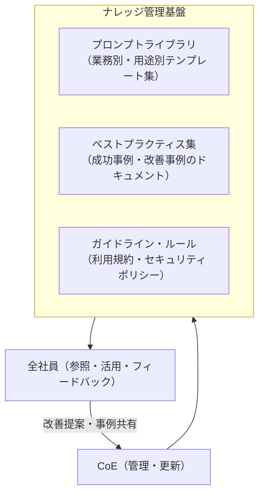

#### プロンプトライブラリの構成要素

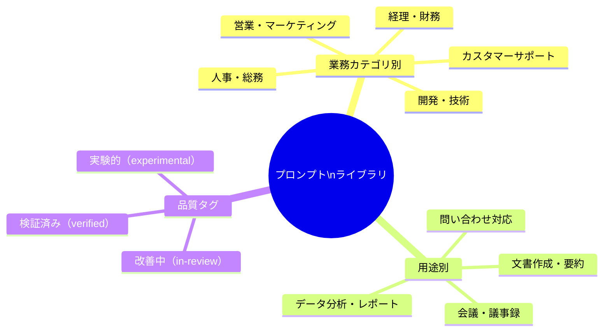

---

### 4.3.2 エージェント活用の基盤を整理する

AIエージェント導入を継続的に機能させるために、組織全体で共有できる「基盤」を整理する。

#### （1）エージェント活用の前提情報の整備

AIエージェントが正確かつ一貫した成果を出すには、**参照するデータ・コンテキスト情報**を整備することが重要である。

- 社内ドキュメント（マニュアル、規程、製品情報など）を**検索可能な形**に整理する
- **RAG（Retrieval-Augmented Generation）**の構築によって、AIエージェントが社内ナレッジを参照しながら動けるようにする
- データの鮮度管理：定期的に情報を更新し、AIが古い情報を参照しないようにする

#### （2）権限管理とデータ保護の整備

AIエージェントが扱うデータ・情報のセキュリティとアクセス制御を整備する。

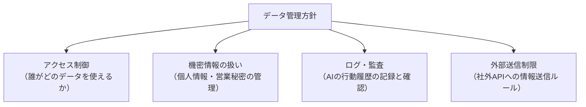

#### （3）コンメディアのナレッジ共有と課題の整備

AIエージェント活用上の**学びや問題を蓄積・共有し、継続的に改善**する仕組みを整える。

- 定期的な「ふりかえり」の実施：どのエージェントが効果的か、どこで課題が出ているかを議論する
- 「成功したプロンプト」と「失敗したプロンプト」を区別し、それぞれから学べることを整理する
- AIエージェント導入を「1回で完成」ではなく、「継続改善サイクル」として位置づける

---

### 4.3.3 「地雷」の回避のおさえておくべきこと

AIエージェント導入において、よくある「地雷（失敗パターン）」を事前に把握しておくことが重要である。

#### 全社導入の7つの落とし穴

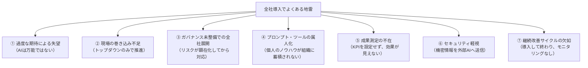

---

## 三｜パートナーエージェント活躍

### エージェント同士の協働（パートナーエージェント）

AIエージェント導入が成熟してくると、**複数のエージェントが役割を分担し協調する「マルチエージェント」構造**が実現する。この構造では「パートナーエージェント」の概念が重要になる。

パートナーエージェントとは、特定の専門領域を担うエージェントが、オーケストレーターや他のエージェントと協働して大きな業務を達成する仕組みである。

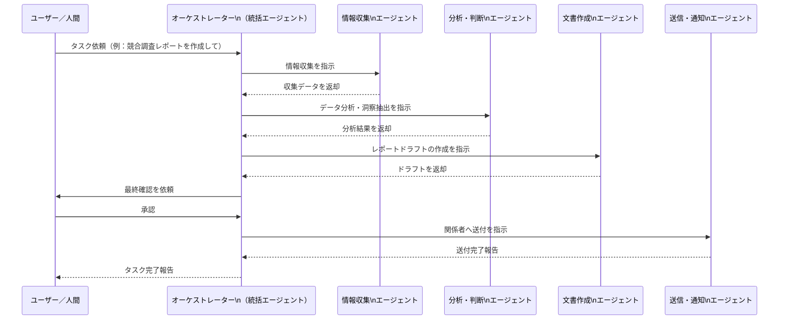

#### パートナーエージェントの設計原則

1. **役割の明確化**：各エージェントは単一の明確な責務を持つ（Single Responsibility）
2. **インターフェースの標準化**：エージェント間のデータ形式・通信方法を統一する
3. **失敗の分離**：一つのエージェントが失敗しても、他のエージェントに影響が出ないよう設計する
4. **人間による監視点の設計**：重要な判断ポイントでは必ず人間がレビュー・承認する

---

### 4.3.1 エージェント導入に伴うスキル習得の整備

AIエージェントを継続的・全社的に使いこなすには、組織全体の**「AIリテラシー」を底上げ**する仕組みが必要である。

スキル習得において重要な観点：

- **習得速度の個人差を前提とする**：全員が同じペースで学べるわけではない。段階的・自己ペースの学習機会を設ける
- **学習と実践を結びつける**：座学だけでなく、実業務の中でAIを使う「実戦型学習」が最も効果的
- **心理的安全性の確保**：「失敗してもいい」「試してみていい」という雰囲気を作る

#### ターナーエージェントの設計プロセス

AIエージェント設計の標準プロセス：

- **役割設計**：エージェントは何をするか / しないかを明確に定義する
- **ツール設計**：エージェントが使用できるツール（検索、DB、API、ファイル操作）を定義する
- **制約設計**：やってはいけないこと・必ず確認すべきことを定義する
- **フォールバック設計**：処理できない場合の代替動作・人間へのエスカレーションを設計する

---

### 4.3.2 エージェント活用の基盤の整備

組織的なエージェント活用の持続性を高めるには、以下の基盤が必要である。

#### （一）エージェント活用の前提条件を明示した運用基盤

AIエージェントの導入・運用にあたって、組織として明示すべき前提条件がある。

- AIエージェントが動く際、業務担当者はどこまで介入すべきかの**人間の関与ルール**の設定
- エージェントの出力は「最終成果物」ではなく「ドラフト」として扱う**品質管理の文化**
- エラーや予期しない挙動が出た場合の**報告・エスカレーションフロー**の整備

#### （二）継続運用の実現に向けた基盤

- **モニタリングダッシュボード**：エージェントの稼働状況・出力品質・エラー率を可視化する
- **フィードバックループ**（一括監視）：現場担当者がエージェントの出力を評価し、改善につなげる仕組みを作る
- **バージョン管理**：プロンプト・ツール設定・モデルのバージョンを管理し、変更履歴を追跡できるようにする

---

## キーワード整理（第4章）

| 用語 | 定義 |
|------|------|
| **AX（AI Transformation）** | AIエージェントを活用した業務・組織変革の全体プロセス |
| **CoE（Center of Excellence）** | AI導入ノウハウを集約し、全社に標準・サポートを提供する組織横断的な機能 |
| **チェンジマネジメント** | 組織変革を人・文化・プロセスの観点から管理・推進する手法 |
| **プロンプトライブラリ** | 業務用途別に整理・共有されたプロンプトテンプレートの集積 |
| **RAG（Retrieval-Augmented Generation）** | AIが社内ナレッジ・ドキュメントを参照しながら回答を生成する技術 |
| **パートナーエージェント** | 特定の専門領域を担い、他のエージェントと協調して動く専門エージェント |
| **オーケストレーター** | 複数のエージェントを指揮・調整する統括エージェント |
| **KPI（Key Performance Indicator）** | 成果を定量的に測定するための重要業績指標 |
| **フォーカスエリア** | AIエージェント化で集中的に取り組む優先業務領域 |
| **AIガバナンス** | AIの利用に関するルール・ポリシー・監視体制の総称 |
| **心理的安全性** | 失敗や挑戦を恐れずに行動できる組織内の雰囲気・文化 |

---

## 全社導入チェックリスト

AIエージェントの全社展開に向けた準備状況の確認：

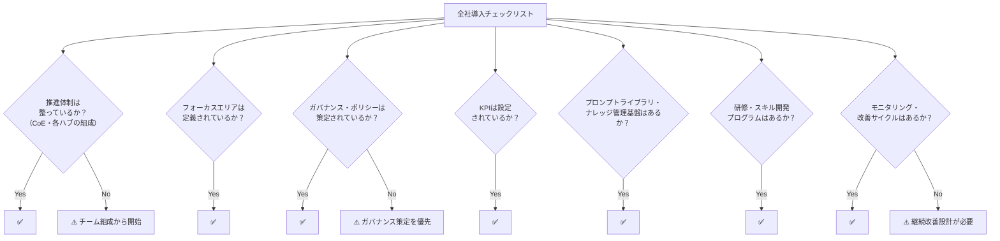

---

*本ドキュメントはRAG（Retrieval-Augmented Generation）用ナレッジとして作成。対象書籍：『AIエージェントの教科書』（ワン・パブリッシング、ISBN: 978-4-651-20527-4）第4章より。*  
*前パートのドキュメント：*
- *`chapter3_ai_agent_business_reform.md`（pp.106〜124）*
- *`chapter3_ai_agent_business_reform_part2.md`（pp.126〜144）*
