# 第3章（続き）｜業務改革実践：AIエージェント活用の進め方

> 出典：『AIエージェントの教科書』（ワン・パブリッシング）  
> 著者：小澤健祐（AINOW編集長 / AICX協会代表理事）  
> 対応ページ：pp.126〜144（第3章の続き）

---

## 3.2 タスクの「自動化レベル」を知る

### 3.2.1 タスクのAIエージェント化における「自動化レベル」を理解する

AIエージェント化を進めるにあたり、すべての業務が同じレベルで自動化できるわけではない。業務ごとに「自動化レベル」を設定し、段階的にアップグレードすることが重要である。

#### 自動化レベルの4段階

AIエージェントによる業務自動化は、以下の4段階で捉えられる。

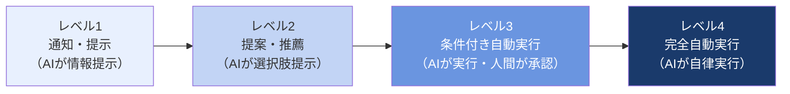

| レベル | 名称 | AIと人間の役割 | 具体的なユースケース |
|--------|------|---------------|-------------------|
| **レベル1** | 通知・提示 | AIが情報を提示し、判断・実行はすべて人間が行う。AIエージェントが取り扱えるデータ量・範囲は人間より広い | FAQに応じた情報提示、社内ナレッジのデータ検索、初期診断データ・カスタマーデータの収集・整理 |
| **レベル2** | 提案・推薦 | AIが選択肢や推薦を提示し、意思決定・確認は人間が行う。AIエージェントは一定の範囲の意思決定をカバーしている | SNS投稿内容の下書き提案、翻訳メモの作成、メール文面の作成、特定の入力に対してのテンプレート提案 |
| **レベル3** | 条件付き自動実行 | AIが一定条件下で自動実行し、例外・判断ケースは人間が対応。AIエージェントは複数ツールを連携させながら自律的に動く | 議事録・サマリーの自動作成と担当者への配布、国内外の競合調査ツールを横断した自動レポート生成、指定条件に合致した際の承認メール自動送信 |
| **レベル4** | 完全自動実行 | AIが完全に自律して実行し、人間への確認なしに処理が完結。AIエージェントは高度なタスクプランニングを実行できる | 大規模データの収集・分析・意思決定・自動実行（例：N&A〔企業の合併・買収〕候補の探索、比較、提案書の作成）、チャットボットによる顧客対応の自動化 |

> **重要原則**：自動化レベルは「業務の性質」と「リスクの大きさ」によって決める。エラーが許容されない業務や倫理的判断が必要な業務はレベル1〜2に留める。反復的・定型的・大量処理業務はレベル3〜4が適している。

#### 自動化レベル決定の判断フロー

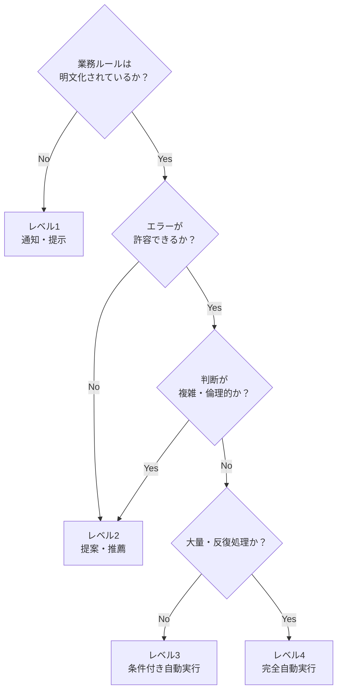

---

### 3.2.2 タスクのAIエージェント化に必要なプロセス設計

AIエージェントを実際に動かすには、業務プロセスをエージェント実行可能な形に設計し直す必要がある。

#### ① 実行可能なタスクへの分解

AIエージェントが処理できる最小単位に業務を分解する。

- 曖昧な指示（「報告書を作成して」）→ 実行可能な指示（「A・B・Cのデータを取得し、D形式に変換し、E宛に送信する」）
- 各ステップに**入力・処理・出力**を明確に定義する

#### ② ツールの選定と連携設計

AIエージェントが利用するツールを定義する。

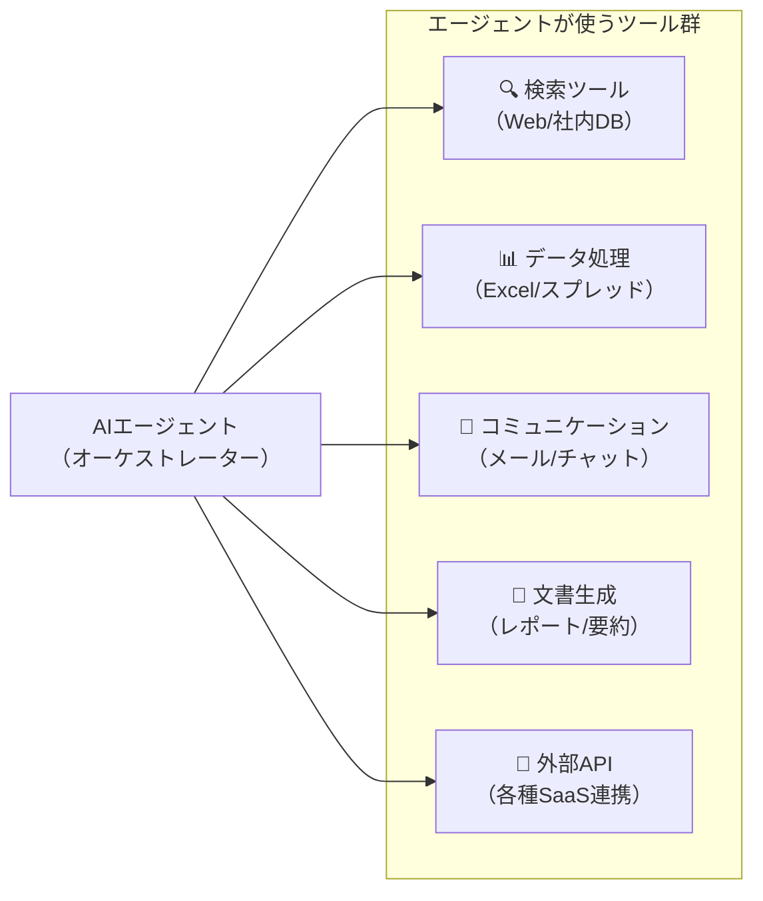

#### ③ 例外処理・エスカレーション設計

AIが自動実行できない例外ケースを事前に定義し、人間へのエスカレーションフローを設計する。

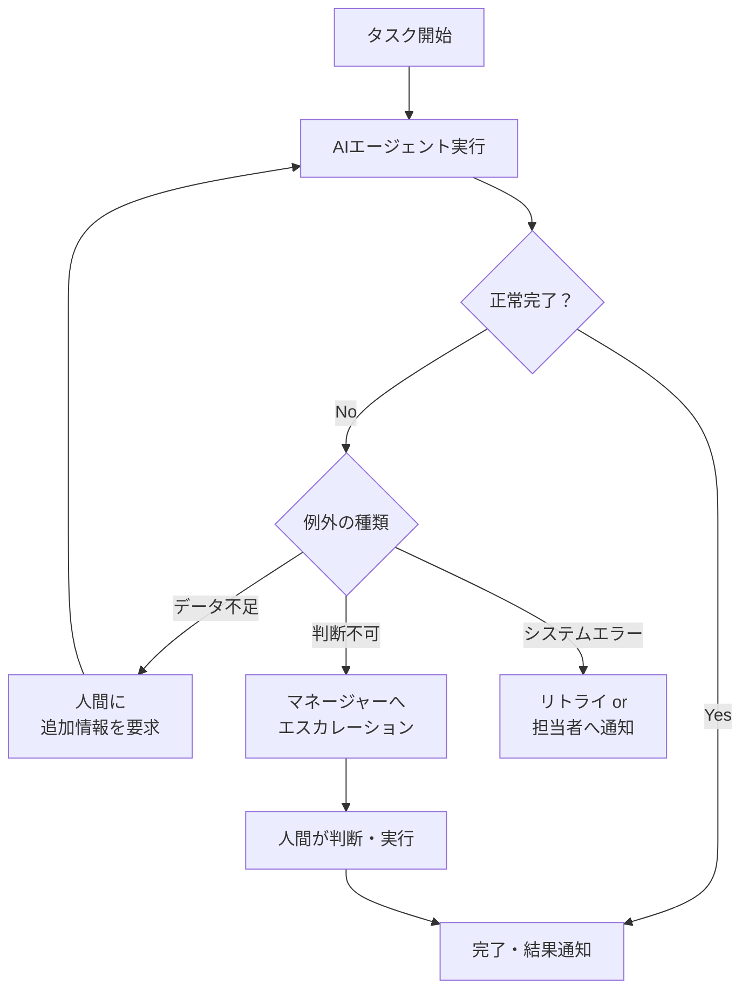

---

## 3.3 ロードマップを作ろう

### AIエージェント化のロードマップ全体像

業務のAIエージェント化は、一度に全体を変えようとするのではなく、**段階的なロードマップ**に基づいて進める。

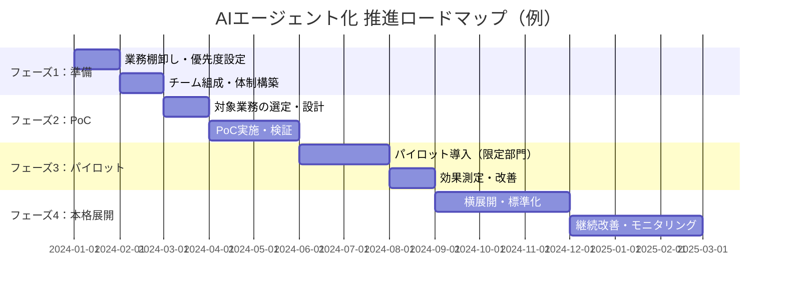

### 3.3.1 ロードマップのステップを理解する

AIエージェント化のロードマップは、以下の4つのステップで構成される。

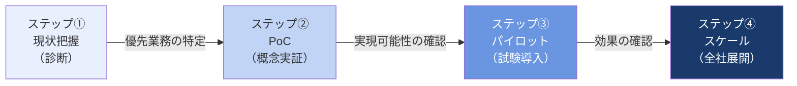

#### ステップ①：現状把握（診断）

- 業務の棚卸しと可視化（HTAやSIPOCを活用）
- AIエージェント化の優先度評価
- 現状のボトルネック・課題の特定
- 推進体制・予算・スケジュールの検討

#### ステップ②：PoC（概念実証）

- 優先度の高い業務を1〜2件選び、小規模に検証
- **検証のポイント**：
  - AIエージェントが技術的に実行可能か
  - 期待する精度・速度が出るか
  - 担当者が使いこなせるか

#### ステップ③：パイロット（試験導入）

- PoCで成果が確認できた業務を、限定された部署・チームで試験導入
- 現場からのフィードバックを収集し、プロセス・プロンプト・ツール連携を改善
- **成果指標（KPI）の設定**：処理時間削減率、エラー率、担当者の満足度など

#### ステップ④：スケール（全社展開）

- パイロットで確立した型を他部署・他業務に横展開
- 標準化されたプロセス・ツールセットを整備
- 継続的なモニタリングと改善サイクルの確立

---

### 3.3.2 ロードマップを作成する際に気をつけること

ロードマップ作成・推進における注意点を整理する。

#### ロードマップ推進の4つのポイント

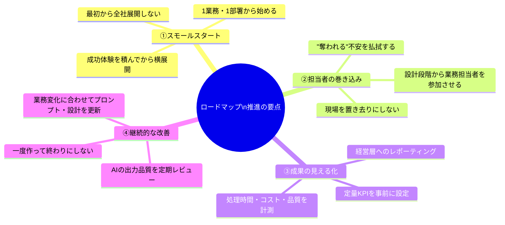

#### ロードマップ推進における典型的な失敗パターン

| 失敗パターン | 原因 | 対策 |
|-------------|------|------|
| **PoC止まり** | 成果が見えにくい業務を選んだ / 組織変革が追いつかない | 効果が可視化しやすい業務を最初に選ぶ |
| **現場の抵抗** | 担当者が蚊帳の外で設計が進んだ | 設計フェーズから現場を巻き込む |
| **品質劣化** | AIの出力を検証せずに本番運用 | レビュー体制とフィードバックループを設ける |
| **スケールできない** | PoCが属人化・個別最適化 | 標準化・ドキュメント化を意識して設計する |

---

## 3.3.3 「自動化レベル×業務マトリクス」でのロードマップ設計

業務とAI自動化レベルを掛け合わせることで、ロードマップの優先度マトリクスを作成できる。

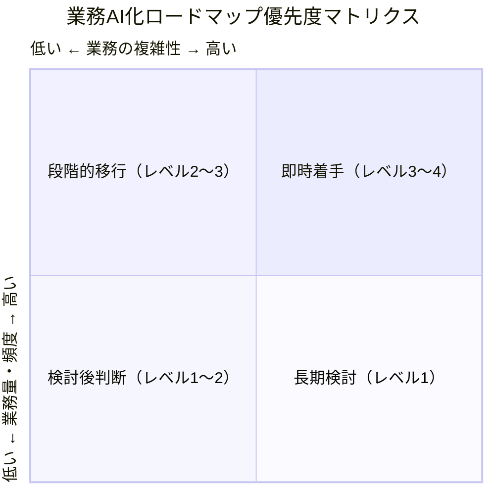

### タスクの「自動化レベル」と「ロードマップ」の統合フレーム

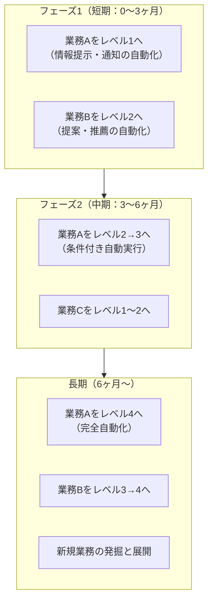

---

## 3.4 プロセスのOODA（観察・判断・決断・行動）

AIエージェントの実行ループを理解するフレームとして**OODA（Observe-Orient-Decide-Act）**が活用できる。

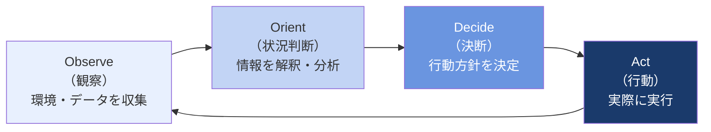

AIエージェントにおけるOODAの対応：

| OODAステップ | AIエージェントでの対応 |
|-------------|----------------------|
| **Observe（観察）** | ツールを使って情報・データを収集する（Web検索、DBクエリ、API呼び出し） |
| **Orient（状況判断）** | 収集した情報をLLMが解釈・分析し、状況を理解する |
| **Decide（決断）** | 次にとるべき行動・使うべきツールをLLMが判断・計画する |
| **Act（行動）** | 選択したツールを実行し、結果を環境にフィードバックする |

---

## 3.4 プロンプト設計とエージェント設計の勘所

### 3.4.1 「良いプロンプト」を作るために理解すべきこと

AIエージェントを設計する際、プロンプト（指示文）の品質が成果を左右する。良いプロンプトには以下の要素が必要。

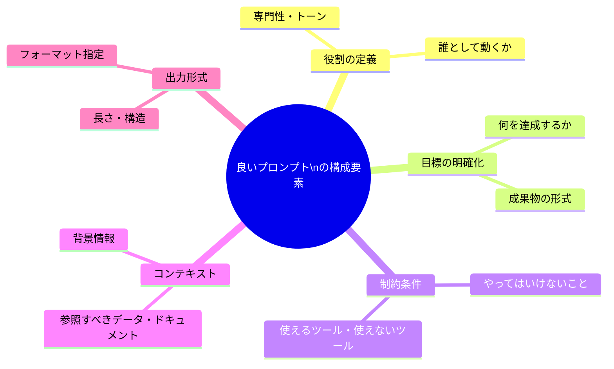

### 3.4.2 プロンプトのOOSAフレーム（観察・最適化・構造化・行動）

#### ①役割（ロール）のプロンプト設計

- AIエージェントに「何者として振る舞うか」を明確に定義する
- 例：「あなたは経験豊富な業務改革コンサルタントです」
- **効果**：一貫したトーン・専門性・判断基準をエージェントに持たせることができる

#### ②目標（ゴール）のプロンプト設計

- AIエージェントが何を達成すべきかを具体的に記述する
- 曖昧な目標「レポートを作って」ではなく、「競合A・B・Cの直近3ヶ月の製品アップデートを調査し、表形式で比較レポートを作成せよ」のように具体化する

#### ③制約（コンテキスト）のプロンプト設計

- やってはいけないこと、使えないリソース、守るべきルールを明記する
- 例：「個人情報を含む情報はレポートに記載しないこと」「外部への送信前に必ず担当者の確認を取ること」

#### ④出力形式（フォーマット）のプロンプト設計

- 成果物の構造・形式・長さを指定する
- 例：「マークダウン形式で出力」「箇条書きで5項目以内にまとめる」「表形式で比較する」

### プロンプト設計の改善サイクル

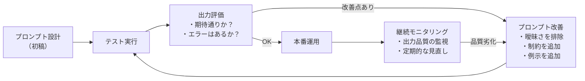

---

## 補足：「業務の型」とAIエージェント化サポートの活用

業務のAIエージェント化を支援するサブエージェントは、以下の「問い」を業務担当者に投げかけることでプロセスを進めることができる。

### 業務ヒアリングのための主要な問い

| ヒアリング軸 | 問いの例 |
|-------------|---------|
| **業務の目的** | 「この業務は最終的に何のために行っていますか？」 |
| **現状の課題** | 「この業務で最も時間がかかっている・手間がかかっているのはどの部分ですか？」 |
| **インプット** | 「この業務を始めるにあたって必要な情報・データは何ですか？」 |
| **アウトプット** | 「この業務の成果物（出力）は何ですか？誰に渡しますか？」 |
| **判断のルール** | 「この業務の中で、どのような基準で判断をしていますか？ルールは明文化されていますか？」 |
| **例外ケース** | 「通常と異なる処理が発生するのはどんな場合ですか？」 |
| **頻度・量** | 「この業務は1日・1週間に何件くらい発生しますか？」 |

### AIエージェント化の適合性スコアリング（簡易版）

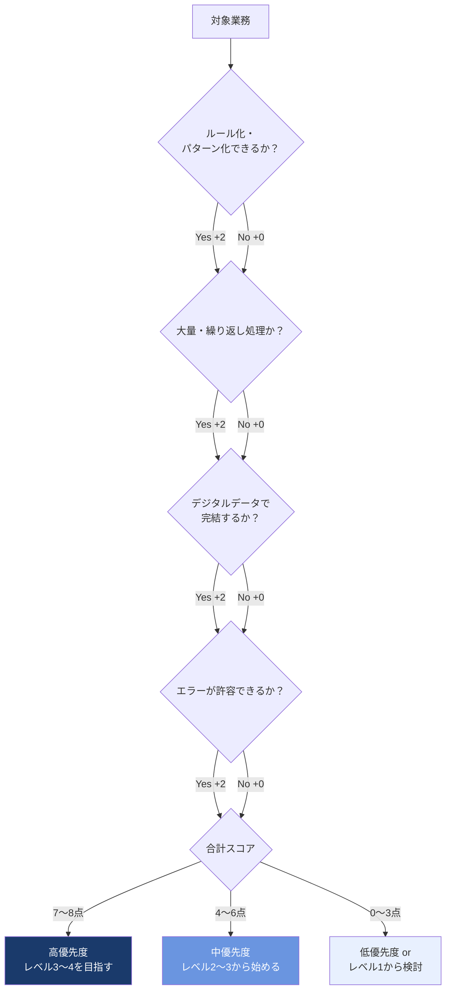

---

## キーワード整理（本パート追加分）

| 用語 | 定義 |
|------|------|
| **自動化レベル（Level 1〜4）** | AIエージェントが業務をどの程度自律的に実行するかを示す4段階の分類 |
| **PoC（概念実証）** | 本格導入前に小規模・短期間で実現可能性を検証するプロセス |
| **ロードマップ** | AIエージェント化を段階的に推進するための時系列計画 |
| **OODA（観察・状況判断・決断・行動）** | AIエージェントの実行ループを表すフレームワーク |
| **エスカレーション** | AIが処理できない例外ケースを人間に引き継ぐ仕組み |
| **プロンプト設計** | AIエージェントへの指示文（役割・目標・制約・出力形式）を設計すること |
| **スモールスタート** | 一部の業務・部署から小さく始め、成果確認後に横展開する進め方 |
| **KPI（重要業績指標）** | AI化の効果を測るための定量指標（処理時間削減率、エラー率など） |

---

*本ドキュメントはRAG（Retrieval-Augmented Generation）用ナレッジとして作成。対象書籍：『AIエージェントの教科書』（ワン・パブリッシング、ISBN: 978-4-651-20527-4）第3章（続き）より。*  
*前パートのドキュメント：`chapter3_ai_agent_business_reform.md`（pp.106〜124）と合わせて参照すること。*
